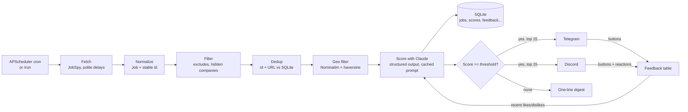

# job-hunter

A self-hosted Python service that, on a schedule:

1. searches job boards with [JobSpy](https://github.com/speedyapply/JobSpy),
2. keeps only **new** postings within a radius of your home city (plus remote, if you want),
3. scores each against your resume and profile with Claude,
4. sends the good matches to **Telegram** and/or **Discord**, with buttons (Interested / Not a fit /
   Hide company / Applied) whose answers feed back into future scoring.

It makes outbound connections only: no inbound ports, no public endpoint.

> **Heads up on scraping:** JobSpy scrapes job boards. That may conflict with some sites' terms of
> service, and sites can block or rate-limit you at any time. This is a personal-use tool: keep the
> search volume modest (see [Rate limits](#rate-limits-and-scraping-etiquette)), and you are
> responsible for how you use it.

## How it works



Details worth knowing:

- **Dedup** works by id (hash of normalized company + title + city) and by URL, so the same job
  reposted on another board is only scored once.
- A job is saved only **after** it has been scored. Anything skipped by a cost guardrail or a
  temporary API error is picked up again on the next run.
- If nothing matches, you get a one-line digest, so silence never means "broken".
- Resume, profile and recent feedback are re-read **before every run**: edit them any time, no
  restart needed.

## Prerequisites

- An [Anthropic API key](https://console.anthropic.com/).
- A Telegram bot and/or a Discord bot (setup below).
- Either [uv](https://docs.astral.sh/uv/) (Python 3.12+) for local runs, or Docker + Docker Compose.

## Quick start

```bash
git clone <your-fork-or-this-repo> job-hunter && cd job-hunter
uv sync                         # installs pinned dependencies from uv.lock
source .venv/bin/activate       # or prefix every command below with `uv run`
cp .env.example .env            # then fill in the secrets (see below)
python -m job_hunter once --dry-run
```

The first run notices that `data/config.yaml`, `data/resume.md` and `data/profile.md` are missing,
creates them from templates, and exits. Edit them:

- `data/config.yaml`: at minimum set `home_location` (the template value is rejected on purpose).
- `data/resume.md`: your resume (`.md`, `.txt` or `.pdf` — a PDF must contain real text, not a scan).
- `data/profile.md`: must-haves, dealbreakers, salary floor, preferences. Be specific, this is what
  separates a 90 from a 60.

Template files carry a marker line and are refused until you replace them, so a blank resume is never
sent to Claude. Run `python -m job_hunter once --dry-run` again: it fetches, filters and scores, then
prints the results (starred = at or above your notify threshold) without saving jobs or sending
anything. Dry runs still call the Anthropic API, so they cost a little.

### Commands

| Command | What it does |
| --- | --- |
| `python -m job_hunter run` | The service: scheduler plus Telegram/Discord listeners (container default) |
| `python -m job_hunter once` | One full pass: fetch, score, send matches (immediately, no cooldown) |
| `python -m job_hunter once --dry-run` | One pass that prints instead of sending and saves nothing |
| `python -m job_hunter test-notify` | Sends one sample job (with working buttons) to your notifier(s) |
| `python -m job_hunter init-db` | Creates the SQLite schema |
| `python -m job_hunter --test-anthropic` | Sends a test prompt to Claude and prints the reply, to prove the key works (also diagnoses the key: source, shape, last 4 characters). Add `--model` to try another model. `check-anthropic` is an alias |
| `python -m job_hunter healthcheck` | Exits 0 if a running service is alive (used by Docker) |

Global option (before the subcommand): `--config path/to/config.yaml`.

In chat, both bots support these commands (Discord: slash commands, replies visible only to you):

| Command | What it does |
| --- | --- |
| `/status` | State, next and last run, spend, and the current threshold / radius / location |
| `/run` | Start a run now (works even while paused) |
| `/pause`, `/resume` | Skip / resume *scheduled* runs |
| `/top` | Best unapplied matches from the last 7 days that clear the threshold |
| `/last_scores [n]` | The top `n` (default 5, max 20) scores from the last run, each with the model's explanation and a mark for whether it cleared the threshold. **Discord: `/last-scores`** (Telegram doesn't allow hyphens in command names) |
| `/threshold [x\|reset]` | Show, set (0-100) or reset the score needed to be notified |
| `/radius [miles\|reset]` | Show, set (1-500) or reset the search radius |
| `/location [City, ST\|reset]` | Show, set or reset the home location (checked on the map before it's saved) |

Button and reaction feedback is only collected while `run` is active.

### Score explanations

Every scored job gets a plain-text explanation of at most 500 characters saying what drove its score
(main matches, gaps, dealbreakers). It is stored with the score, printed by `once --dry-run`, and
shown by `/last_scores` - the quickest way to see why a run produced nothing above your threshold.
The model's reply is enforced as JSON by the API (structured outputs), and the explanation is required.
Jobs scored before this feature existed have no explanation; `/last_scores` shows their reasons and
concerns instead.

### Changing settings from chat

`/threshold`, `/radius` and `/location` change the running service without editing files or
rebuilding. `config.yaml` stays the source of the starting values; a change made in chat is stored in
the database as an *override* and wins until you `reset` it. Settings you haven't overridden keep
following `config.yaml`, so editing the file (and restarting) still works for them. `/status` shows
each value and where it came from, e.g. `65 (set from chat; config.yaml: 70)`.

- **Threshold** applies to jobs scored from then on. Lowering it doesn't re-send old jobs, but
  `/top` immediately lists recent ones that now clear it.
- **Radius** and **location** apply from the next run, to both the search and the distance filter.
  Jobs already saved keep the distance they were given.

## Creating the Telegram bot

1. In Telegram, open [@BotFather](https://t.me/BotFather), send `/newbot`, and follow the prompts.
   BotFather gives you a **bot token** → `TELEGRAM_BOT_TOKEN`.
2. Open a chat with your new bot, press **Start**, and send it any message. (A bot cannot message you
   first.)
3. Find your **chat id** → `TELEGRAM_CHAT_ID`. The simplest way: message
   [@userinfobot](https://t.me/userinfobot), which replies with your numeric id (for a private chat,
   user id and chat id are the same). Alternatively open
   `https://api.telegram.org/bot<TOKEN>/getUpdates` in a private window and read `"chat":{"id":...}`.
   Group chats have negative ids.
4. `python -m job_hunter test-notify` should deliver a sample job.

Only `TELEGRAM_CHAT_ID` may receive messages, press buttons or run commands; every other update is
dropped before any handler sees it.

## Creating the Discord bot

1. Go to the [Developer Portal](https://discord.com/developers/applications) → **New Application**.
2. **Bot** tab → **Reset Token** → copy it → `DISCORD_BOT_TOKEN`.
3. Still on the **Bot** tab, under *Privileged Gateway Intents*, leave **all three off**. The bot
   needs no privileged intents: it uses only guilds, guild messages and guild reactions, and never
   reads message content.
4. **Invite it** to your server with the minimal permission set. Replace `YOUR_APP_ID` (General
   Information → Application ID):

   ```
   https://discord.com/oauth2/authorize?client_id=YOUR_APP_ID&scope=bot+applications.commands&permissions=85056
   ```

   `85056` = View Channel + Send Messages + Embed Links + Read Message History + Add Reactions.
   `applications.commands` is required for the slash commands.
5. In Discord, enable **Settings → Advanced → Developer Mode**. Then right-click the channel you want
   job posts in → **Copy Channel ID** → `DISCORD_CHANNEL_ID`; right-click **your own name** →
   **Copy User ID** → `DISCORD_ALLOWED_USER_ID`.
6. Make sure the bot can see that channel, then run `python -m job_hunter test-notify`.

Only `DISCORD_ALLOWED_USER_ID` counts: clicks, reactions and slash commands from anyone else (and
from the bot itself) are ignored. Reactions (👍 👎 ⛔ ✅) work like the buttons, including on older
messages, and removing a reaction undoes it.

### Discord webhook fallback

If you only want one-way posts and no feedback, skip the bot entirely: create a webhook in the
channel's settings (**Integrations → Webhooks**) and set only `DISCORD_WEBHOOK_URL` with
`notifier: discord`. You get plain embeds with no buttons, reactions or commands. If both a bot and a
webhook are configured, the bot is used.

### Using both

`notifier: both` sends every match to Telegram and Discord. Feedback from either one goes into the same
table and counts equally.

## Configuration

`data/config.yaml` holds non-secret settings. It is validated at startup (unknown keys are errors).

| Key | Default | Meaning |
| --- | --- | --- |
| `home_location` | *(required)* | City to search around and measure distance from, e.g. `Austin, TX`. Overridable from chat: `/location` |
| `radius_miles` | `50` | Keep jobs within this distance of home. Overridable from chat: `/radius` |
| `include_remote` | `true` | Also keep jobs flagged remote |
| `searches` | *(required)* | List of `- term: "..."` entries (max 200) |
| `sites` | all but google | Any of `indeed`, `linkedin`, `zip_recruiter`, `glassdoor`, `google`. Google is opt-in because it currently returns nothing through JobSpy |
| `hours_old` | `24` | Only postings from the last N hours |
| `results_per_search` | `30` | Results wanted per site per search |
| `fetch.searches_per_run` | `8` | With more searches than this, runs rotate through them |
| `fetch.delay_seconds` | `[3, 8]` | Random pause between scrape calls |
| `fetch.linkedin_fetch_description` | `true` | +1 request per LinkedIn job; needed for good LinkedIn scores |
| `schedule_cron` | `0 7,12,18 * * *` | Five-field cron, evaluated in `timezone` |
| `timezone` | `America/Chicago` | IANA timezone name |
| `exclude_companies` | `[]` | Company names to drop (case/punctuation-insensitive) |
| `exclude_title_keywords` | `[]` | Whole-word, case-insensitive: `intern` won't match "International" |
| `scoring.model` | `claude-haiku-4-5` | Any current Claude model, e.g. `claude-sonnet-5-5`. Requests adapt to what the model accepts (see below). Verify ids in Anthropic's docs |
| `scoring.min_score_to_notify` | `70` | Score (0-100) needed to notify. Overridable from chat: `/threshold` |
| `scoring.max_jobs_scored_per_run` | `60` | Cost guardrail per run |
| `notifier` | `telegram` | `telegram`, `discord` or `both` |
| `notify.cooldown_seconds` | `300` | Minimum gap between job messages per notifier in `run` mode; `0` sends everything at once |
| `resume_path` | `data/resume.md` | `.md`, `.txt` or `.pdf` |
| `profile_path` | `data/profile.md` | Your requirements and preferences |

Jobs whose location can't be geocoded are kept but flagged "distance unknown" rather than silently
dropped. At most 15 matches are sent per run, best first.

### Notification cooldown

To avoid a burst of pings, `run` mode doesn't send all of a run's matches at once. The first goes out
immediately and the rest are queued and released **one per `notify.cooldown_seconds` (default 5
minutes) per notifier**, highest score first. So 8 matches take about 35 minutes to arrive.

- The queue is stored in the database, so it survives restarts. Items older than 48 hours are dropped, and
  a message that keeps failing is dropped after 5 attempts.
- `/status` shows how many messages are queued. `/pause` stops scheduled *runs*; messages already queued
  keep trickling out.
- The "nothing matched" digest and failure notices are sent immediately.
- `python -m job_hunter once` is a manual one-off and sends everything immediately.
- Prefer silence over spacing? Raise the value (e.g. `1800`). Prefer everything at once? Use `0`.

### Choosing a scoring model

`scoring.model` can be any current Claude model. Scores are requested with structured outputs
(`output_config.format`), so the API guarantees the reply is JSON matching the score schema; this works on
Haiku 4.5, Sonnet 5/5.5, Opus 4.8/5/5.5 and Fable. A model that rejects structured outputs falls back to the
same schema as a tool call (forced where allowed, otherwise `tool_choice: auto` with one re-ask). `effort: low`
is sent where supported and dropped where it isn't (Haiku 4.5), and replies leave room for thinking tokens.
`python -m job_hunter --model <id> --test-anthropic` runs this exact request on a sample job and reports
which mode the model ended up using and its explanation, so test a new model before a real run.

### Environment variables (non-secret)

| Variable | Default | Meaning |
| --- | --- | --- |
| `MAX_WEEKLY_BUDGET_USD` | *(none)* | Cap on estimated Claude spend per rolling 7 days; scoring stops when reached |
| `CONFIG_PATH` | `data/config.yaml` | Config location (`--config` overrides) |
| `DB_PATH` | `data/jobs.db` | SQLite database (the heartbeat file lives next to it) |
| `ENV_FILE` | `.env` | Which env file to load |
| `LOG_LEVEL` | `INFO` | Python log level |

## Secrets

Secrets never go in `config.yaml`, in the image, or in git. They are held as `SecretStr` (so they
never print in a repr), registered with the log redactor, and read from one of two backends.

| Secret | Needed when |
| --- | --- |
| `ANTHROPIC_API_KEY` | always |
| `TELEGRAM_BOT_TOKEN`, `TELEGRAM_CHAT_ID` | notifier includes telegram |
| `DISCORD_BOT_TOKEN`, `DISCORD_CHANNEL_ID`, `DISCORD_ALLOWED_USER_ID` | notifier includes discord (bot mode) |
| `DISCORD_WEBHOOK_URL` | discord, as the one-way fallback |

### Option 1: `.env` (default)

`cp .env.example .env` and fill it in. The CLI loads `.env` from the current directory itself
(handling Windows line endings, quotes and trailing comments); real environment variables win over
the file. Docker Compose loads it via `env_file`. `SECRETS_BACKEND=env` is the default.

### Option 2: AWS SSM Parameter Store

Store each secret as a **SecureString** parameter named `<SSM_PREFIX><NAME>`, e.g.
`/job-hunter/ANTHROPIC_API_KEY`, then set:

```
SECRETS_BACKEND=aws_ssm
AWS_REGION=us-east-2
SSM_PREFIX=/job-hunter/
```

AWS credentials come from the standard chain (environment variables or `~/.aws`) and need
`ssm:GetParametersByPath` on that prefix plus `kms:Decrypt` on its key. boto3 is an optional extra:

```bash
uv sync --extra aws                          # local
docker compose build --build-arg WITH_AWS=true   # container (or set it in docker-compose.yml)
```

## Running locally

```bash
uv sync
python -m job_hunter test-notify     # check your bot(s) work
python -m job_hunter run             # leave it running (tmux, systemd, ...)
```

`Ctrl+C` or SIGTERM shuts it down cleanly. Nothing runs at start-up; the first scheduled run happens at
the next cron time, or send `/run`.

## Running with Docker Compose

```bash
mkdir -p data && sudo chown -R 10001:10001 data     # the container runs as uid 10001 (Linux)
cp .env.example .env                                # fill in secrets
docker compose build
docker compose run --rm job-hunter once --dry-run   # first run creates data/ starter files; edit them
docker compose run --rm job-hunter test-notify
docker compose up -d
docker compose logs -f
```

Do the first-run step *before* `up -d`, otherwise the container exits asking you to edit the starter
files and `restart: unless-stopped` keeps restarting it.

The container is locked down: non-root (uid 10001), read-only root filesystem, `/data` as the only
writable volume (plus tmpfs `/tmp`), `no-new-privileges`, all capabilities dropped, no ports published,
a heartbeat-based healthcheck, and no data, `.env` or secrets baked into the image. Inside the container
`/data` holds `config.yaml`, `resume.md`, `profile.md` and `jobs.db`.

## Cost and guardrails

Each new in-radius job is scored with one small Claude call (a few thousand input tokens, ~150 output
tokens). With Haiku that is roughly **$0.003 per job** as an order-of-magnitude estimate; Claude Sonnet 5.5
(about twice Haiku's per-token price, plus any thinking tokens) is roughly twice that. The large,
stable part of the prompt (instructions + resume + profile + recent feedback) is marked for prompt
caching; very short prompts may fall below the model's minimum cacheable size and pay full price.

Guardrails, in the order they bite:

1. `scoring.max_jobs_scored_per_run` (default 60) caps a single run: worst case about 18 cents.
   The cap is shared fairly: before scoring, candidates are interleaved round-robin across your search
   terms (and across sites within each term), so with 4 titles and a cap of 60 each title gets about 15,
   and a title with fewer candidates passes its unused share to the others. Without this, the first
   title alone can return up to `results_per_search` × the number of sites and use up the whole cap. Jobs
   that don't fit are not saved, so they're considered again next run. The log line `scored per search:
   {...}; left for a later run: {...}` shows the split, and `/last_scores` shows which search found each job.
2. `MAX_WEEKLY_BUDGET_USD` caps estimated spend over a rolling 7 days. It is checked before every call,
   so it can overshoot by at most one job. Dry runs count too. When it trips, the CLI says so, the
   digest mentions it (when nothing matched), and skipped jobs are scored next run.
3. `/status` shows spend against the cap.

Costs are **estimates** from a built-in per-model price table (Haiku, Sonnet 5.x and 4.x, Opus, Fable;
unknown models are costed at the most expensive tier). Check real usage in the Anthropic console, and verify the price table in `score.py` against
Anthropic's current pricing.

## Rate limits and scraping etiquette

Job boards rate-limit and block scrapers, and JobSpy is a best-effort tool. The service is built to be
gentle:

- One JobSpy call per (search term × site group); Google gets its own call.
- A random `fetch.delay_seconds` pause between calls (default 3-8 s).
- **Rotation:** at most `fetch.searches_per_run` (default 8) search terms are used per run. With more
  terms (up to 200), each run takes the next slice and wraps around, and `hours_old` is widened
  automatically so the lookback window covers a full rotation. 10 terms means 2 runs' worth of 8, not a
  flood; 150 terms is still ~16 calls per run.
- **Back-off:** two consecutive failures for a site group and it is skipped for the rest of the run.
- Each site failure is logged and isolated, so one blocked site never fails the run.
- **Blocked sites are dropped for the run:** JobSpy logs a block (Cloudflare 403, Glassdoor 400...) and
  carries on, so the sign is a site that keeps returning zero rows. After two empty calls in a row it is
  skipped for the rest of that run, and a warning names it. The log line for each call shows rows per
  site (`by_site={...}`), so you can see which boards are actually working.
- Nominatim geocoding is limited to 1 request/second, uses a descriptive User-Agent, and caches every
  result (including failures) in SQLite.

LinkedIn is the most fragile: fetching descriptions costs one extra request per job. If it keeps
failing, set `fetch.linkedin_fetch_description: false` or drop `linkedin` from `sites`.

## Troubleshooting

| Symptom | Likely cause / fix |
| --- | --- |
| `No module named job_hunter` | Run `uv sync` (or `uv run python -m job_hunter ...`) |
| "Created starter files... Edit them" | Expected on first run; edit `data/` files and rerun |
| `home_location` / "unedited template" errors | Replace the placeholder city and the template resume/profile |
| `Missing required secrets: ...` | The named variable isn't set or `.env` isn't in the current directory (`ENV_FILE` overrides) |
| No jobs from one site, errors in logs | The site is blocking or rate-limiting you: wait, raise `fetch.delay_seconds`, lower `searches_per_run`/`results_per_search`, or remove the site |
| `ZipRecruiter ... 403 forbidden` | Cloudflare is blocking the scraper. Usually temporary; remove `zip_recruiter` from `sites` if it persists |
| `Glassdoor ... status code 400` / `location not parsed` | Glassdoor's location lookup is rejecting the request (an upstream block or API change, not your location). Remove `glassdoor` from `sites` if it persists |
| `google` always returns 0 rows | Google blocks or changed its markup; it is a JobSpy-level problem and the default config leaves it out |
| `skipping job after scoring failure: ... 400` | The log shows Anthropic's own error message. "credit balance too low" means add credit in the console and the run stops immediately; three failures in a row abort the run instead of burning calls |
| Zero results everywhere | `hours_old` too small, search terms too narrow, or all sites blocked; try `once --dry-run` with `LOG_LEVEL=DEBUG` |
| Everything scores low | Make `data/profile.md` more specific; give feedback with the buttons |
| `Anthropic rejected the API key` | Run `python -m job_hunter --test-anthropic`. It never prints the key but shows where it came from, its length and last 4 characters (compare with the console), common paste problems, and Anthropic's own answer. The classic cause: a key `export`ed in your shell **overrides `.env`**; the CLI warns about this, and `unset ANTHROPIC_API_KEY` fixes it |
| model not available | Check `scoring.model` against the model ids in Anthropic's docs |
| Buttons do nothing | The service must be running (`run`). Telegram keeps unread presses ~24 h |
| Telegram silent | You must message the bot first; check `TELEGRAM_CHAT_ID` |
| Discord slash commands missing | Re-invite with the `applications.commands` scope; the bot syncs them on start |
| Container unhealthy | `docker compose logs`; the healthcheck reads `/data/.heartbeat`, written every 60 s |
| "weekly budget reached" | Raise `MAX_WEEKLY_BUDGET_USD` or wait; skipped jobs are scored later |

`LOG_LEVEL` applies to this project's own logs only. Every third-party library (Anthropic, HTTP,
Telegram, Discord, JobSpy) stays at WARNING regardless, because at INFO/DEBUG they log full request
bodies and URLs. JobSpy's own error lines are routed through the same redacting JSON logger.

## Rotating keys, and what to do if one leaks

Rotate each credential at its source, update `.env` (or SSM), then restart (`docker compose up -d`).

| Credential | How to rotate |
| --- | --- |
| `ANTHROPIC_API_KEY` | Console → API keys → create a new key, update, then **delete the old one** |
| `TELEGRAM_BOT_TOKEN` | @BotFather → `/revoke` (pick the bot) → copy the new token |
| `DISCORD_BOT_TOKEN` | Developer Portal → your app → Bot → **Reset Token** |
| `DISCORD_WEBHOOK_URL` | Channel → Integrations → Webhooks → delete it, create a new one |
| AWS credentials | IAM → deactivate/delete the access key, create a new one; SSM values: put a new parameter version |
| `*_CHAT_ID`, `*_CHANNEL_ID`, `*_USER_ID` | Identifiers, not secrets, but they decide who the bot trusts: keep them correct |

If a key leaks (committed, pasted in a log or chat, screenshot):

1. **Revoke it first**, before cleaning anything up. Assume it was already copied.
2. Issue a replacement and update your deployment.
3. Check for misuse: Anthropic console usage, unexpected Telegram/Discord messages, AWS CloudTrail.
4. If it was committed, rewriting history (`git filter-repo` or BFG) removes it from the repo, but not
   from forks, caches or clones, so step 1 is the one that matters.
5. Find out how it got there. `pre-commit` runs gitleaks locally and CI scans the full history: install
   the hooks with `uv run pre-commit install`.

## Development

```bash
uv sync                       # includes dev tools
uv run pre-commit install     # gitleaks, ruff, mypy, whitespace and large-file checks
uv run ruff check . && uv run ruff format --check . && uv run mypy src && uv run pytest
```

The tests use no network: JobSpy, geocoding, Anthropic, Telegram and Discord are all mocked, with a saved
JobSpy CSV fixture. CI (`.github/workflows/ci.yml`) runs ruff, mypy, pytest and gitleaks on every push,
and builds the Docker image.

### Layout

```
src/job_hunter/
  __main__.py      CLI entry
  config.py        config.yaml + .env loading; pydantic models; fails fast
  bootstrap.py     first-run starter files from templates
  secrets.py       EnvProvider / AwsSsmProvider, SecretStr
  fetch.py         JobSpy wrapper: rotation, delays, back-off
  geo.py           Nominatim + haversine, SQLite cache
  models.py        Job dataclass and normalization
  store.py         SQLite schema, migrations, dedup, feedback
  score.py         Claude scoring: structured output, caching, cost estimate
  pipeline.py      fetch -> filter -> dedup -> score -> notify
  service.py       scheduler, on-demand runs, pause, heartbeat
  commands.py      /status /run /pause /resume /top
  feedback.py      shared feedback actions
  logging_setup.py JSON logs with secret redaction
  notify/          telegram_bot.py, discord_bot.py, base.py
```
